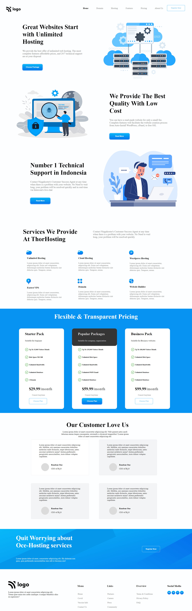

# Description
This is a sample page. The website focuses on implementing the basics of HTML and CSS to create this amazing static webpage.

## Time taken

4 hours and 30 mins

## Learned 
- More on Positioning and Margins

### The deployed Version Link

[Hosting](https://hostingplat.netlify.app/)

### SnapShot of the Webpage

